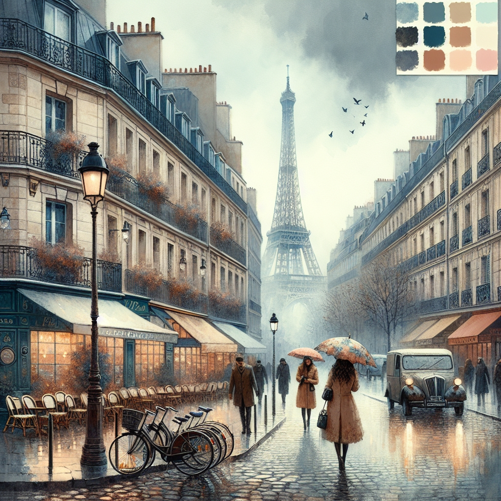

# Image Generation Chatbot


## About

This Image Generation Chatbot is a Streamlit application that uses OpenAI's DALL-E 3 model to generate images based on user prompts. It provides an interactive chat interface where users can describe the image they want, and the AI will generate and display the image in real-time.

## Features

- Interactive chat interface
- Real-time image generation using DALL-E 3
- Chat history persistence
- Responsive design

## Sample Generated Images

Here are some examples of images generated by the chatbot:

<div style="display: flex; flex-wrap: wrap; justify-content: space-between; gap: 20px;">
  <div style="width: calc(50% - 10px); text-align: center;">
    
    <p><em>A rainy day in Paris</em></p>
  </div>
  <div style="width: calc(50% - 10px); text-align: center;">
    
    <p><em>Amazon rainforest</em></p>
  </div>
  <div style="width: calc(50% - 10px); text-align: center;">
    
    <p><em>SpaceX Starship</em></p>
  </div>
  <div style="width: calc(50% - 10px); text-align: center;">
    
    <p><em>Buddhist monastery in Tibet</em></p>
  </div>
</div>


## Run the Streamlit app:
   ```
   streamlit run image_gen.py
   ```

## Usage

1. Enter a description of the image you want to generate in the chat input.
2. Press Enter or click the send button.
3. Wait for the AI to generate and display the image.
4. Continue the conversation or start a new one for more image generations.

## Technologies Used

- Python
- Streamlit
- OpenAI API (DALL-E 3)
- Pillow (PIL)
- python-dotenv
